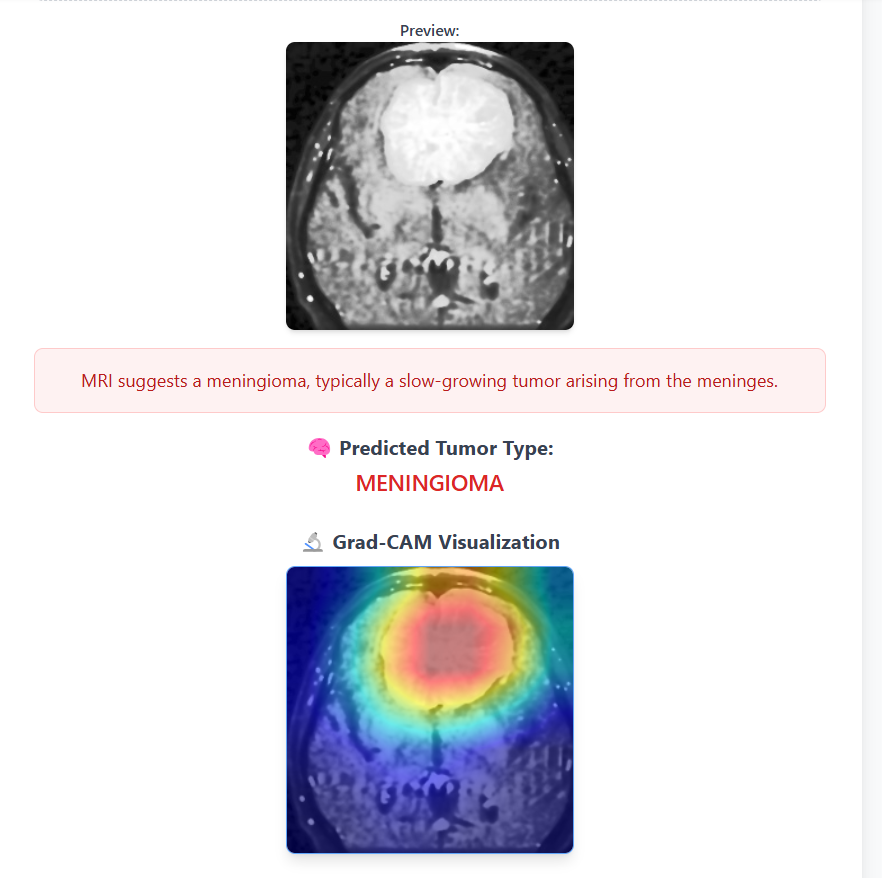
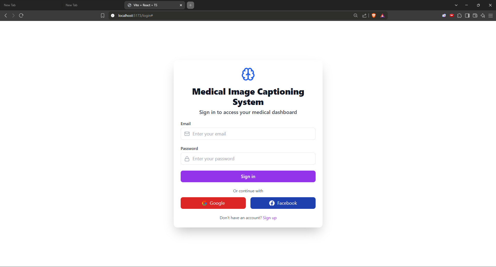
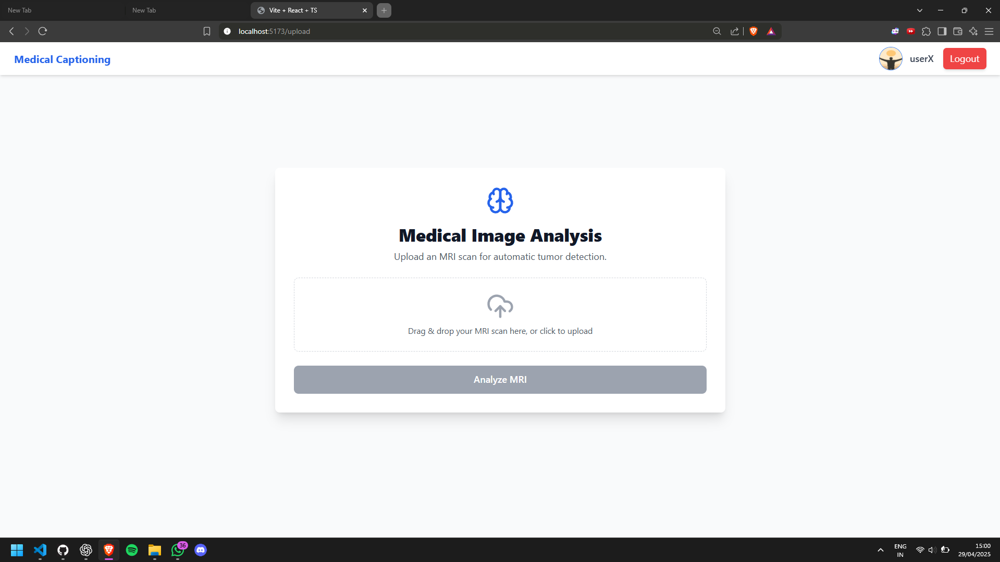
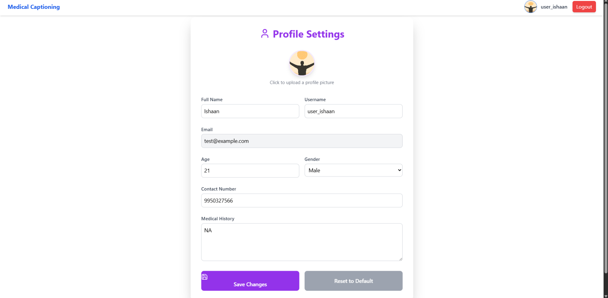
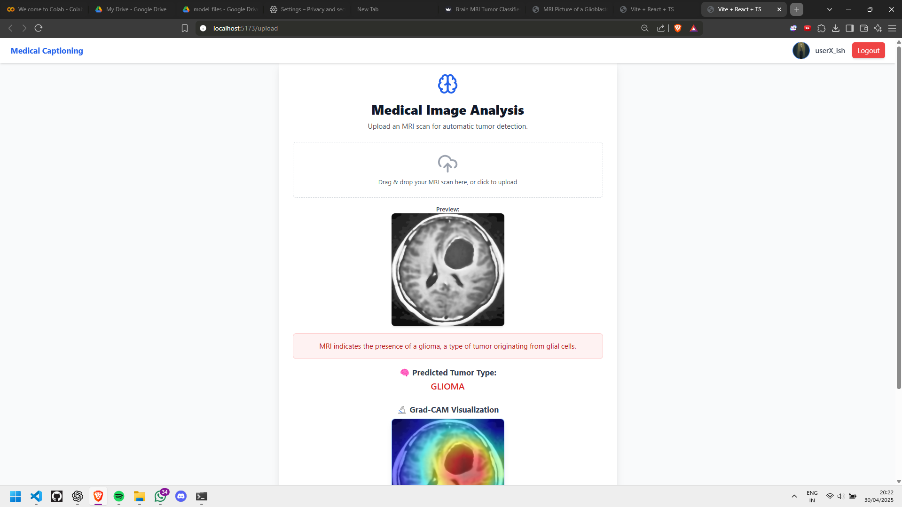

# 🧠 Medical Image Caption Generation using Generative Transformers

A full-stack AI-powered system for automated brain tumor **prediction** and **caption generation** from MRI scans. This project integrates **Vision Transformers (ViT)**, **Knowledge-Aware Networks (KAN)**, **Grad-CAM**, and a modern **Flask + React** interface to make deep learning results interpretable and interactive.

---

## 📸 Visual Preview

<p align="center">
  
  
  
  
  
</p>

---

## 🚀 Features

- 🧠 Tumor prediction from MRI using **ViT + KAN**
- 📝 Automatic generation of **domain-specific medical captions**
- 🔍 Visual explainability via **Grad-CAM**
- 🖼️ Real-time web interface (React + Tailwind CSS)
- 🔗 Fully integrated backend using **Flask** and **PyTorch**

---

## 🛠️ Tech Stack

| Layer          | Tools                                      |
|----------------|--------------------------------------------|
| **Model**      | PyTorch, Vision Transformer (ViT), KAN     |
| **Explainability** | Grad-CAM                              |
| **Backend**    | Flask, Torchvision, Pillow, Joblib         |
| **Frontend**   | React, TypeScript, Tailwind CSS, Dropzone  |
| **Storage**    | LocalStorage (frontend), `.pth`, `.pkl`    |

---

## 📂 Project Structure

```plaintext
Medical-Image-Captioning/
├── frontend/           # React app for UI
├── backend/            # Flask app with model + API
├── outputs/            # Screenshots (used in README)
├── model.pth           # Trained model
├── label_encoder.pkl   # Class mapping
├── app2.py             # Flask API script
├── README.md
```

---

## 🧪 To Use

```bash
npm install
npm run dev
python app2.py
```

---

## 👥 Project Team & Acknowledgments

**Mentor**  
Dr. Kamakshi Rautela

**👨‍💻 Team Members**
- Ronit Singh
- Ishaan Narayan  
- Aryan Chaudhary  
- Riya Gupta  


---

## 📬 Contact

For questions, collaborations, or feedback, feel free to connect:

- 📧 Email: Ronits2704@gmail.com
- 🔗 LinkedIn: [www.linkedin.com/in/ronitsingh2/](www.linkedin.com/in/ronitsingh2/)  

---
